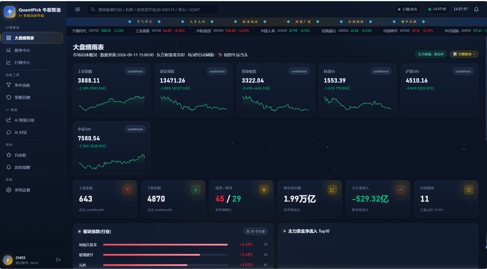
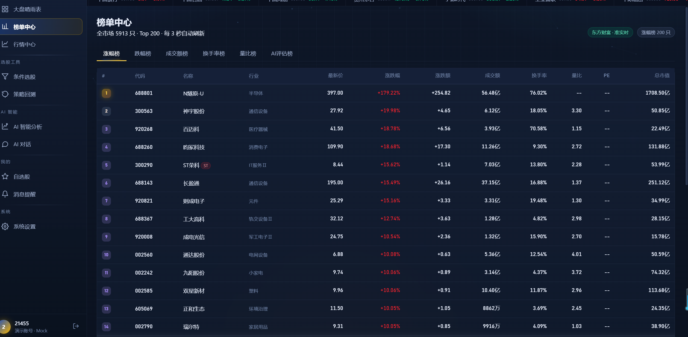
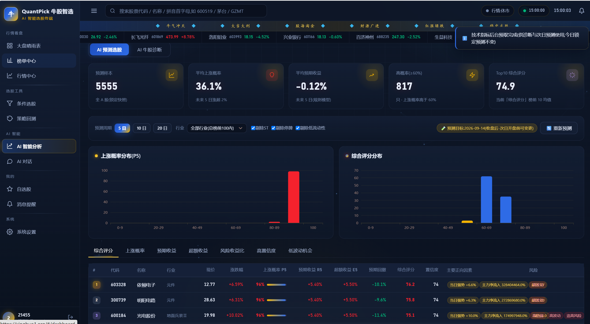
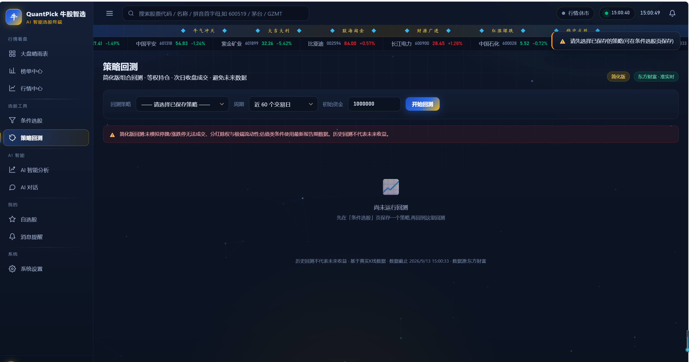

# QuantPick 牛股智选

> 零依赖的 A 股真实数据研究终端 —— 条件选股 · 行情分析 · AI 预测与复盘 · 策略回测
>
> **在线体验**：<https://xinghuo1.org>（登录页点「一键体验演示账号」即可，无需注册）

[](LICENSE)
[](https://nodejs.org)
[](#技术特点)
[](#数据来源与合规)

> ⚠️ **本项目仅供学习研究，不构成任何投资建议。** 详见 [免责声明](#免责声明)。

---

## 界面预览

### 大盘晴雨表 · 市场总体概况



### 榜单中心 · 完整排行 + AI 评估榜



### AI 智能分析 · 预测选股（概率 / 预期收益 / 综合评分）



### 策略回测 · 净值曲线 + 蒙特卡洛回撤



> 界面为深色「深海蓝金」主题；**红涨绿跌**符合 A 股习惯（可在设置中切换）。

---

## 这是什么

一个**跑起来只要 `node server.js`** 的 A 股研究工具。没有 `package.json`、没有 `node_modules`、
没有构建工具、没有数据库 —— 整个后端只依赖 Node 内置模块（`http` / `fs` / `path` / `zlib` / `dns`）。

```
克隆 → node server.js → 打开 http://127.0.0.1:8090
```

它做四件事：

| 模块 | 做什么 |
|---|---|
| **行情与榜单** | 全市场约 5900 只股票的实时行情、指数、涨跌/成交额/换手/量比完整榜单 |
| **条件选股** | 可视化组合条件（AND / OR / NOT + 40 余个字段），策略可保存、导出 CSV |
| **AI 智能分析** | 预测选股（上涨概率 / 预期收益 / 超额收益 / 回撤）+ 个股六维评分诊断 |
| **回测与复盘** | 策略回测（含蒙特卡洛回撤、窗口稳健性）+ 预测台账与累计胜率 |

---

## 技术特点

- **零依赖**：后端只用 Node 内置模块，不装任何 npm 包（`js/vendor/echarts.min.js` 已内置，离线可用）
- **只用真实数据**：数据全部来自东方财富 + 腾讯公开接口；**服务不可用时页面明确报错，绝不展示模拟数据**
- **透明规则模型**：预测不是黑盒机器学习，而是可追溯、可复算的规则概率模型（见下节）
- **多源兜底 + 熔断**：上游多主机重试，连续失败自动熔断切换备用源
- **性能优化**：响应 gzip 压缩（全市场 2.56MB → 707KB）、静态资源 ETag/304、全市场磁盘快照（冷启动 4.5s → 73ms）
- **自带回归测试**：`_smoke/` 下 200+ 项测试（jsdom 驱动，覆盖引擎逻辑与页面真实渲染）

---

## 快速开始

### 方式一：本地运行（推荐）

要求 **Node.js ≥ 16**（[下载](https://nodejs.org)）。

```bash
git clone https://github.com/<你的用户名>/quantpick.git
cd quantpick
node server.js
# 浏览器打开 http://127.0.0.1:8090
```

Windows 用户也可以直接双击 **`start.bat`**（自动启动服务并打开浏览器）。

> ⚠️ 必须通过 `server.js` 访问（它同时托管前端并代理数据接口）。直接双击 `index.html` 无法连接数据服务，
> 页面会明确报错且**不会展示任何模拟数据**。

### 方式二：在线体验

直接访问 <https://xinghuo1.org>，点「一键体验演示账号」。

### 方式三：部署到服务器 / 打包桌面版

- [`deploy/DEPLOY.md`](deploy/DEPLOY.md) —— 云服务器、Nginx 反代、HTTPS、云函数等方案
- [`deploy/STEP-BY-STEP.md`](deploy/STEP-BY-STEP.md) —— 逐步操作手册
- [`deploy/DESKTOP.md`](deploy/DESKTOP.md) —— 打包成免安装 Node 的 Windows 桌面单文件版

---

## 预测与复盘：怎么预测、怎么验证

这是本项目最用心的部分，也最容易被误读，因此单独说明。

### 1. 预测什么

对全 A 股计算四个维度的**概率与数值**（不是简单的"涨/跌"二分类）：

| 目标 | 含义 |
|---|---|
| 上涨概率 P5 / P10 / P20 | 未来 5 / 10 / 20 个交易日收益超过 **2% / 5% / 8%** 的概率 |
| 预期收益 R5 / R10 / R20 | 对应周期的预期收益 |
| 超额收益 | 相对基准的超额部分 |
| 预期回撤 / 置信度 | 风险与把握程度 |

**综合评分公式**（权重公开、可复算）：

```
综合评分 = 35%×上涨概率 + 30%×预期收益 + 15%×超额收益
         + 10%×行业强度 − 10%×风险
```

### 2. 怎么保证可验证

- **按真实交易日历锁定**：交易日由**上证指数日K推导**（指数有K线的日期才是交易日），
  并叠加交易所公布的休市安排 —— 因此**春节、国庆等假期不会被误判为交易日**。
  开盘（9:30）至收盘（15:00）之间预测锁定不可变更；收盘后可重新预测下一交易日。
- **快照存服务端**：每个交易日的预测（总榜前 100 只，含全部周期字段）生成快照存入服务端台账，
  跨设备、清缓存都不会丢。
- **收盘后自动复盘**：对照真实日K逐只判定命中 / 未中，统计命中率、预测收益与实际收益的偏差、
  实际最大回撤，无需人工操作。

### 3. 长期胜率

单个快照只是**一个样本**。项目把多个交易日的快照汇总起来，给出：

- **累计命中率**（方向一致即命中：预测概率 ≥50% 且实际上涨，或预测概率 <50% 且实际未涨）
- **滚动 5 期 / 10 期命中率**（按样本数加权，避免样本少的快照被高估）
- **预测偏差趋势**（平均预测收益 − 平均实际收益）

复盘样本量可选 **Top10 / Top20 / Top50**，用于观察结论对样本量的敏感程度。

### 4. 回测不只看收益

- **蒙特卡洛回撤**：对净值日收益做有放回重采样，模拟 400 条路径，给出回撤分布
  （中位数 / P95 / 最差）与「**比历史回撤更差**」的概率 —— 用于判断历史回撤是否偏乐观
- **窗口稳健性分析**：同一策略在近 60 / 120 / 180 / 250 个交易日分别重跑，
  按「各窗口均盈利且均跑赢基准 / 均盈利 / 存在亏损」给出稳健性评级，避免被单一区间的漂亮数字误导

---

## 功能清单

- **行情看盘**：大盘晴雨表（指数 + 涨跌家数 + 涨停跌停 + 成交额 + 主力净流入 + 市场温度 + 板块涨跌）、
  榜单中心（涨跌幅 / 成交额 / 换手 / 量比 Top200 + AI 评估榜）、行情中心（全市场行情表）
- **选股工具**：条件选股（AND/OR/NOT 组合、40+ 字段、策略保存与 CSV 导出）、策略回测
- **AI 智能**：AI 智能分析（预测选股 / 个股六维诊断，页内分页切换）、AI 对话
- **我的**：自选股（分组管理）、消息提醒（价格与涨跌预警）
- **系统**：系统设置（红涨绿跌切换、数据源状态）

界面为深色「深海蓝金」主题，**红涨绿跌**符合 A 股习惯（可在设置中切换）。

---

## 数据来源与合规

| 数据 | 来源 |
|---|---|
| 行情 / K线 / 资金流 / 财务 / 分红 / 新闻 | 东方财富公开接口（多主机兜底） |
| 实时行情兜底 | 腾讯财经公开接口（多域名兜底） |
| 交易日历 | 上证指数日K推导 + 交易所公布的休市安排 |

- 以上均为**第三方公开接口**，本项目不对其可用性、准确性做任何担保。
- 使用时请自行遵守各数据源服务条款；**请勿高频抓取**（项目已内置缓存与并发限制以降低压力）。
- 接口若变更或限流，相关功能可能暂时不可用 —— 这是使用公开接口的固有风险。
- 东方财富搜索接口的 token 是其网页前端公开使用的固定值（非私钥），可用环境变量
  `EM_SEARCH_TOKEN` 覆盖。

---

## 目录结构

```
quantpick/
├── server.js              # 零依赖数据服务:静态托管 + /api/* 聚合代理 + 交易日历 + 预测台账
├── index.html             # 应用入口
├── start.bat              # Windows 一键启动(启动服务并打开浏览器)
├── css/style.css          # 设计系统(深海蓝金主题)
├── js/
│   ├── data.js            # 数据层与格式化
│   ├── real.js            # 真实数据接入(行情/榜单/全市场/K线缓存/日历/台账同步)
│   ├── screener.js        # 条件选股引擎
│   ├── ai.js              # 六维评分引擎
│   ├── predict.js         # 预测引擎 + 快照 + 复盘 + 累计胜率
│   ├── backtest.js        # 回测引擎 + 蒙特卡洛 + 窗口稳健性
│   ├── app.js             # 应用外壳:路由 / 页面 / 图表 / 交互
│   └── vendor/echarts.min.js   # Apache ECharts(Apache-2.0,本地内置,离线可用)
├── website/index.html     # 官网(纯静态,可与应用同域部署)
├── deploy/                # 部署文档与脚本(云服务器 / HTTPS / 桌面版构建)
└── _smoke/                # 回归测试(jsdom)
```

---

## 测试

测试位于 `_smoke/`，用 jsdom 驱动真实页面 + 真实数据服务。

```bash
cd _smoke
npm i jsdom                  # 测试依赖(仅测试需要)

node run.js                  # 无服务模式(降级行为)
node predict-engine.js       # 预测引擎(权重/边界/锁定规则)
node predict-ui.js           # 预测页 + 诊断页渲染
node real-ui.js              # 真实数据端到端渲染
node calendar.js             # 交易日历判定(含节假日)
node snapshot-sync.js        # 预测台账同步
node review-history.js       # 累计胜率汇总
node backtest-analysis.js    # 蒙特卡洛回撤 + 窗口稳健性
node nav-groups.js           # 导航分组
node website-smoke.js        # 官网内容与配色同步

# 隔离运行器:独立端口 8091 + 独立数据目录,自动启停被测服务
powershell -ExecutionPolicy Bypass -File run-isolated.ps1
```

---

## 已知限制（诚实说明）

- 全市场选股与回测基于**精选样本池**（全市场逐只加载 K 线不现实），非全市场回测
- 回测**未模拟**停牌、涨跌停无法成交、分红除权与极端流动性；估值类条件使用最新报告期数据（非当时可得）
- 预测模型是**透明规则概率引擎**，不是机器学习模型，请勿高估其能力
- 股东户数 / 十大股东、北向资金、分钟级资金流暂未接入
- 依赖第三方公开接口，接口变更或限流会导致相应功能暂时不可用

---

## 免责声明

- 本项目**仅供学习、研究与技术交流**，**不构成任何投资建议**。
- 所有数据来自第三方公开接口，准确性以数据源为准；**软件输出不保证正确，历史表现不代表未来收益**。
- 在中国境内，从事证券投资咨询业务需要相应资质。本项目**不提供荐股服务**，
  仅为数据处理与统计计算工具；请勿用于任何需要持牌的经营活动。
- **股市有风险，投资需谨慎。据此操作，风险自担。**

---

## 第三方许可

- [Apache ECharts](https://echarts.apache.org/) —— Apache License 2.0
  （`js/vendor/echarts.min.js`，文件内保留原始许可头）
- [jsdom](https://github.com/jsdom/jsdom) —— MIT（仅在运行 `_smoke/` 测试时需要）

## License

[MIT](LICENSE) © 2026 QuantPick
